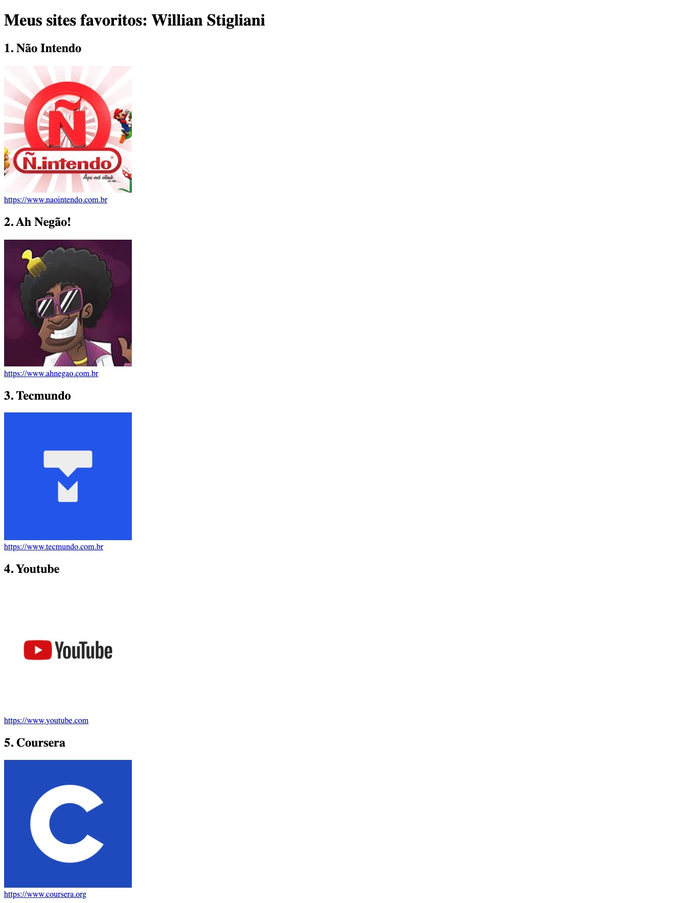

# Meus sites favoritos: Willian Stigliani

Este projeto é uma página HTML simples que mostra meus sites favoritos:

1. **Não Intendo** - [https://www.naointendo.com.br](https://www.naointendo.com.br)
2. **Ah Negão!** - [https://www.ahnegao.com.br](https://www.ahnegao.com.br)
3. **Tecmundo** - [https://www.tecmundo.com.br](https://www.tecmundo.com.br)
4. **Youtube** - [https://www.youtube.com](https://www.youtube.com)
5. **Coursera** - [https://www.coursera.org](https://www.coursera.org)

